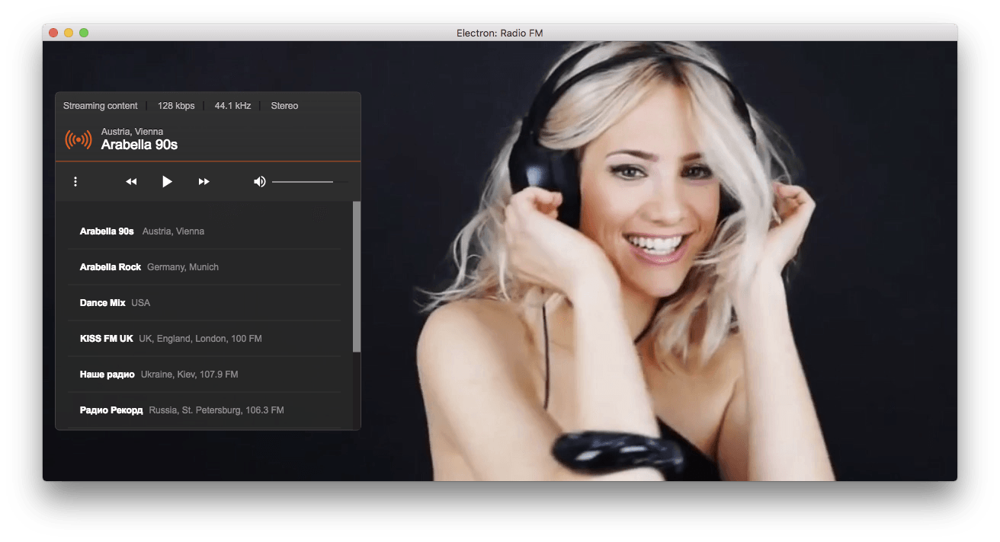

# Electron: Radio FM



## Installation

OSX:

```
npm install && npm run osx
```

Windows:

```
npm install && npm run win
```

Linux:

```
npm install && npm run linux
```

## Development setup

The application can be ran in development mode using the command npm below.

Development:

* Clone/copy the repo
* Navigate to the main folder
* Open the terminal and use ```npm install``` to install the dependencies
* ```npm start``` to start the application
